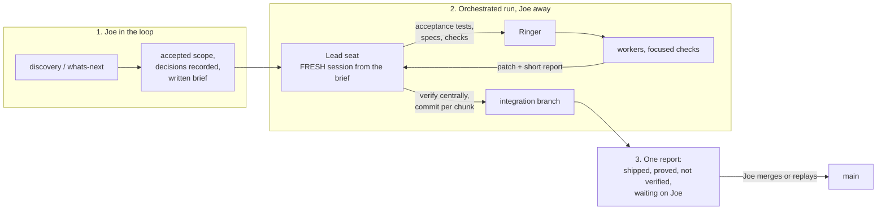

# PM orchestrated runs: lead seat, context budget, integration branch

Status: accepted and implemented in pm 0.21.0 (2026-09-20). Joe took the
recommended answer on all four decisions. The measure below is still open: no
run has happened under these rules yet.
Date: 2026-09-20
Source: Joe's direction on 2026-09-20 ("a model like Fable or Astra leading the
orchestration, and the other models doing the implementation"), two field runs,
and a seat-usage measurement taken for this intent.

Evidence:
[Marvel field report](../research/orchestrate-ringer-field-report-marvel-2026-09-20.md) ·
[Hermes pilot 1](../research/hermes-tokenusage-pilot-2026-09-15.md) ·
[Hermes pilot 2](../research/hermes-tokenusage-pilot-2-2026-09-15.md) ·
[pm-018](pm-018-orchestrator-lanes.md) · [pm-019](pm-019-session-succession.md) ·
[pm-020](pm-020-model-economy.md)

**Host.** The orchestrator is a Claude Code or Codex session running the
`orchestrate` skill. Hermes is evidence here, not a target. Every rule has to
read the same in the generated Codex package.

**No new pieces.** The stack stays host + Ringer + the `orchestrate` skill.
This intent changes the wording of one skill and adds one optional per-repo
note. No new scripts, config files, tools or services in pm. Anything a repo
needs to make a worktree runnable is that repo's own script.

## The pattern

## Problem

Two runs of this pattern worked and both overspent in the same place: the
orchestrator's own context.

| | Hermes pilot 2 (09-15) | Marvel (09-20) |
|---|---|---|
| Orchestrator | Sol 900K, one persistent chat | Fable, a Claude Code session already a day old |
| Orchestrator calls | 311 | 125 |
| Context per call | ~236K | ~436K (327K at the first call, 532K at the last) |
| Orchestrator tokens | 73.7M | 54.6M |
| Worker tokens | not totalled | 20.15M (8 tasks, $18.40 list) |
| Result | 14 tickets, 7 h, 5 failed runs self-repaired | 8 of 8 first try, ~50 min |
| Cost signal | week's Codex allotment gone, HTTP 429 | lead seat used 2.7x the workers' tokens, on the dearest model |

Marvel numbers are from the orchestrator session's transcript
(`4ecb59dc…`), de-duplicated by message id, 10:43Z (Joe's "start
orchestrating") to 11:13Z (Joe asks for the report). Writing the report and
committing added 37 more calls and 20.5M tokens at ~553K per call. No dollar
figure: there is no list price for Fable on hand and the plan is not billed per
token. Plan reading at 11:45Z was Weekly Fable 24%, all models 17%; that cannot
be attributed to this run alone.

So pm-020's worry is confirmed, but the cause is not "Fable led". It is that the
run started inside a 327K-token session and every one of 125 calls re-read it.
Hermes hit the same wall on a cheaper model. The Hermes fix (fresh session per
ticket, a compaction cap, capped tool output, heavy checks delegated) was
applied on 09-16 and has never been run, so it is a hypothesis, not a result.

Both runs also hit the same three operational walls: nothing committed at the
end (Hermes: the commit prompt timed out, 19 modified and 25 untracked files;
Marvel: wave 3 needed a throwaway base branch), worker environments discovered
by hand (Hermes: PTY hang, expired auth, wrong Python; Marvel: a worktree with
no dependencies, a lane with no `git` or `cp`), and state reported from the
wrong place (Hermes: a session with no `cwd` described another project;
Marvel: a live check against another worktree's backend).

## Accepted direction

New rules, then sharpened ones. "Report #n" is the Marvel change list.

### New

**A. Context budget for the lead seat.** Both runs.
- An orchestrated run starts in a fresh session from a written brief: accepted
  scope, tickets, decisions, authorization. Not in the discovery session.
- Ringer's run stdout never streams into the session. Read the summary table
  and result files by path.
- Workers return a short report; the orchestrator reads diffs by path.
- Past a stated budget (proposed 150K), rotate at the next wave boundary: a
  manual fresh session from a handoff. Succession stays opt-in (pm-019).
- At close, record seat usage in the report: context size at the start and end
  of the run (the host shows it) and the workers' totals from Ringer's summary.
  TokenUsage already has the per-session detail when a closer look is wanted.

**B. Acceptance tests first.** Report #1. For code nodes the orchestrator writes
the contract tests, runs them against the base to see them fail for the right
reason, and the check copies them into the worktree fresh on every run.

**C. Worker environment note plus preflight.** Report #2, #3; Hermes pilot 1.
One markdown note per repo, written the first time that repo is orchestrated:
what a worktree lacks (dependencies, generated types, local databases), the
repo's own verify command that makes a worktree runnable, which commands the
worker lane allows, which paths are off limits, the supported runtime. The
verify script lives in the repo, not in pm. Preflight before the first
dispatch: worker auth, runtime version, non-interactive shell.

**D. Integration branch.** Report #4; Hermes pilot 2. See decision 2.

**E. Generated artifacts and local state.** Report #7; both runs. The
orchestrator regenerates generated files in the real checkout; a worker's
copies are evidence only. Before reporting any state, name the checkout and
the backend it was read from.

**F. Standing seat preferences.** Report #8. Lead, implementation, docs and
review seats named once in pm-020 and `WORKFLOW.md`, as text. No config file.
See decision 4.

**G. Human gates hold while Joe is away.** Hermes pilot 2.
- A `needs-human` ticket is closed only by Joe. The orchestrator may recommend
  closing it, in the report.
- An unanswered decision never drops. Park it on the ticket (`Waiting on:`),
  keep working what doesn't depend on it, and put it at the top of the report.

**H. Fixed end-of-run report.** Report #10. Shipped by chunk; what each check
proved; not verified; waiting on Joe. Tickets Joe asked for are listed apart
from tickets the orchestrator filed itself (Hermes reported "14 of 14" after
filing five of them).

### Sharpened (already in the skill, not followed)

- **Checks and load.** Report #5. §3 already says worker checks stay light and
  heavy checks run centrally. Add: CPU load as well as memory before fan-out;
  workers run focused tests; the full suite runs once per wave, throttled.
- **Size floor.** Report #6. §1 already allows skipping delegation for small
  work. Add a number (proposed: under an hour of solo work is not its own
  worker) and say where small fixes go. See decision 1.
- **One wave per run.** Report #9. §3 already says dispatch ready nodes, join,
  then recompute. Say plainly: no second run under the same name while one is
  live.

## Decisions (Joe accepted each recommendation, 2026-09-20)

1. **Lead seat.** Amend pm-020 so Fable or Astra may lead an orchestrated run?
   Recommended: yes, on two conditions. Rule A is in force, and a review-tier
   lead seat is manager-only: at 436K per call, a small fix it makes itself is
   the most expensive way to make it, so small fixes go out as one batched
   cheap worker. An Opus or Sol orchestrator may still do small fixes directly.
   Keep the amendment if the next measured run shows orchestrator tokens at or
   below worker tokens.
2. **Commits.** Recommended: the orchestrator commits each verified chunk to an
   integration branch; `main` is untouched until Joe merges or replays. Both
   runs ended with a large uncommitted tree; this keeps "commits on Joe's word"
   true for `main`.
3. **Where the worker environment note lives.** Recommended:
   `docs/agents/worker-env.md`, read by `orchestrate` and created on the first
   orchestrated run in that repo (pm's "never pre-create" rule), not by
   `pm-scaffold`. `CLAUDE.md` loads in every session and this matters only
   during a run.
4. **Model choice when Joe is away.** Recommended: yes, from the standing seat
   preferences (F), falling back to the local Ringer scoreboard, and stated in
   the report.

## Decision after the fleet check, 2026-09-20

Three weeks of Claude Code logs: 1,236M, 989M, then 2,545M tokens the week
orchestration became the default. Context per call held (238K, 190K, 234K);
calls doubled (5,185 → 10,854). Joe's call: go back to the old loop as the
default. One session, one outcome, `whats-next` → work → `stepping-away`, and
`stepping-away` offers to open a fresh session for the next ready work.
`orchestrate` stays, opt-in, under the rules above. Tokens per accepted ticket
is still unmeasured. Parallel work defaults to the new `sibling-sessions` skill
(independent tickets, each its own session and merge, no watcher) ahead of
subagents; every orchestrated run now records tickets accepted and
tokens used. Engine idea parked: `docs/research/orchestration-engine-concept.md`.

## Acceptance

- `pm/skills/orchestrate/SKILL.md` carries A–H and the three sharpened rules.
- `pm/WORKFLOW.md`, `pm/template/CLAUDE.md` and pm-020 agree on the lead seat.
- `pm/template/CLAUDE.md` lists `docs/agents/worker-env.md` in the taxonomy as
  a sprout-on-first-run file. Nothing new under `pm/scripts/`.
- `tests/test_pm_model_policy.py` pins the new seat rule and fails if source or
  the generated Codex package loses it; `scripts/build_codex.py` regenerates.
- pm version bumped.

## Measure

Per orchestrated run: orchestrator tokens, worker tokens, context per call,
first-try rate, repair rounds, Joe's interruptions. Target for the next run:
lead-seat context per call under 150K and orchestrator tokens at or below
worker tokens.

## Not in scope

- Hermes as the orchestrator.
- Automatic succession (pm-019 stays an opt-in experiment).
- Changes to Ringer itself. Two asks belong in Ringer's inbox: what two live
  runs under one `run_name` do to the artifact page, and a quiet mode that
  prints only the summary table.
