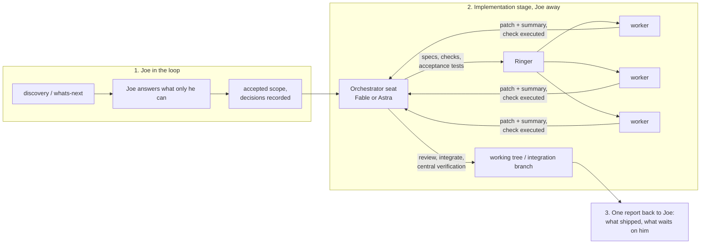
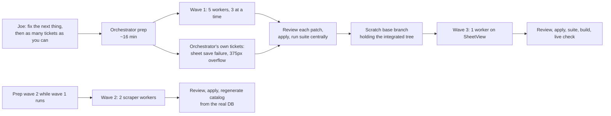

# Field report: one orchestrator, Ringer workers, eight tickets (Marvel, 2026-09-20)

Status: field evidence for the orchestrated implementation stage. Not an intent. Filed here at Joe's direction so it feeds the pm workflow and plugins.

Related: [pm-018 orchestrator lanes](../intent/pm-018-orchestrator-lanes.md) · [pm-019 session succession](../intent/pm-019-session-succession.md) · [pm-020 model economy](../intent/pm-020-model-economy.md) · `pm/skills/orchestrate/SKILL.md`

Source: one Claude Code session in the `RPG/Marvel` repo (a Next.js + TypeScript app under `apps/marvel`, a Node + SQLite scraper under `scraper/`). The orchestrator was Fable; workers ran under Ringer on the claude lane. Written by the orchestrator, so read it as one seat's account. Numbers come from Ringer's run summaries and the workers' own result metadata. The per-ticket detail is in that repo's `_pm/sessions/2026-09-19-campaign-screens.md`.

## The pattern Joe wants to standardize

This run was stage 2 and 3 of that picture. Stage 1 had happened earlier in the same session (Joe made the one design call that blocked the work, then said go).

**It conflicts with pm-020 as written.** pm-020 says ordinary orchestration runs on Opus or Sol, and Astra and Fable are review seats only, reached through Ringer. Here Fable led and Opus implemented, which is what Joe described on 2026-09-20 as the target ("a model like Fable or Astra leading the orchestration, and the other models doing the implementation"). If that becomes the standard, pm-020 and the orchestrate skill's "Astra and Fable are review capacity" paragraph need amending together. The cost evidence below is what that decision should weigh: the orchestrator seat's own context is the expensive part that this report does not measure.

## What ran

| Task | Model | Type | Result | Elapsed | Tokens (cache-inclusive) | List cost |
|---|---|---|---|---:|---:|---:|
| ledger-grid-and-pick-sum | claude-opus-5 | code-fix | PASS, first try | 194s | 1.60M | $1.62 |
| profile-build-adjustments | claude-opus-5 | code-feature | PASS, first try | 218s | 1.58M | $1.58 |
| power-boxes-next-rank | claude-opus-5 | code-feature | PASS, first try | 394s | 2.67M | $2.47 |
| readme-and-stale-caveat | claude-sonnet-5 (audition) | docs | PASS, first try | 149s | 1.67M | $0.69 |
| rules-docs-crosscheck | claude-opus-5 | research | PASS, first try | 532s | 4.83M | $4.36 |
| scraper-preflight-and-backup | claude-opus-5 | code-feature | PASS, first try | 266s | 1.85M | $1.93 |
| catalog-maneuvers-vehicles | claude-opus-5 | code-feature | PASS, first try | 439s | 4.09M | $3.77 |
| turn-and-recovery | claude-opus-5 | code-feature | PASS, first try | 287s | 1.86M | $2.02 |

Eight of eight passed their check on the first attempt. About $18.40 at list price, drawn from the same plan allowance as the orchestrator seat, not billed per token. Wall clock from the instruction to the last patch integrated was roughly 50 minutes. The orchestrator also shipped two tickets of its own and closed two research questions from the database in the gaps.

PASS means the check passed. What each check proved is in its `verified` line in the manifest; for the six code tasks that was "the orchestrator's acceptance tests, the whole suite, tsc and eslint pass in the worktree, and only owned files changed". For the README and the rules audit it was a delivery contract only.

## What worked

**Acceptance tests written by the orchestrator, before dispatch.** This was the single best decision. I wrote the contract tests, ran them against `main` to see them fail for the right reasons (10 failed, 5 unchanged-behaviour assertions passed), and had the check copy them into the worktree fresh on every run so a worker could not edit them. The worker had a precise target, the check could not be satisfied by vacuous tests, and review became "is this patch minimal and in style" instead of "does it work". All six code tasks passed first try and none needed a repair round. The tests now live in the repo, so the cost bought permanent coverage.

**Disjoint file ownership decided up front.** Every task named its owned paths, the validator rejected anything else, and `globals.css` was reserved for the orchestrator. Seven patches applied to the working tree with zero conflicts. It also means the uncommitted work splits cleanly into per-ticket commits by path.

**The fix-swarm validator kit.** `templates/fix-swarm/checks/fix-swarm.py` handled patch export, the summary contract, and the ownership check. I only had to supply a verify command. Reusing it instead of writing my own check harness saved real time.

**Baselining checks before spending a worker.** Both the app tests and the scraper validators were run against an untouched tree first. That caught a check that would have been impossible (`targetNumber` does not exist on `RollRequest`) before a worker burned an attempt on it.

**Preparing the next wave while the current one runs.** Wave 2's verify script was written and baselined, and wave 3's tests drafted, while wave 1 was still typing. The orchestrator was never idle and the workers were never waiting on a spec.

**Delivery-contract tasks were honest about their limits, and the orchestrator read still mattered.** The rules audit was checked only for "every quote really is at the cited line". It came back with 12 findings that held up when I spot-checked the rules. The README passed its contract and still had three wrong statements (a campaign field the new-character form doesn't have, an incomplete campaign page description, an invented claim about storage and build origins). A green check did not catch those; reading it did.

**Opus as the implementation seat.** Patches were small, matched the surrounding style, and the workers made sensible unprompted calls (copying the `-wal` sidecar in the DB backup, reading `evaluation.record` so a party PC's dropped boxes are not credited). Sonnet's audition on docs passed and cost under half of an Opus task, with the accuracy caveat above.

## What didn't, or cost more than it should

**Setup is heavy for small tickets.** About 16 minutes of orchestrator time went to loading two skills, reading the kit, reading interfaces, writing four acceptance tests, a verify wrapper, and a manifest before the first worker started. For the ledger ticket (a dozen lines of JSX) delegation was slower and dearer than doing it directly; Ringer's own gate says as much. Delegation paid for itself on the larger tasks (power boxes, catalog parser, turn and recovery, the audit) and on parallelism, not on the small ones. Next time: batch tiny fixes into the orchestrator's own lane and only delegate tasks with at least an hour of solo work in them.

**A worktree is not a runnable checkout.** `node_modules`, `.next` route types, `.env.local`, and the scraper database are all gitignored, so a fresh worktree can't run a single test. I had to write `verify.py` and `verify_scraper.py` to symlink `node_modules`, run `next typegen`, copy the database in, and clean up afterwards (a `node_modules` symlink is not ignored by a `node_modules/` rule and would have polluted the patch). That wrapper was the most fragile part of the setup and is project-specific. It belongs in the repo as a documented script, not in a session scratchpad.

**The claude lane's tool allowlist shaped the design.** Workers get `python3`, `npm`, `npx`, `node`, `pnpm` and nothing else: no `bash`, `ln`, `cp`, or `git`. That is why the verify step had to be a Python script. One worker tried a compound command ending in `git status` and had it denied; it recovered, but a spec should say up front which commands exist.

**Uncommitted integration versus workers that start from HEAD.** Joe's rule is that commits happen on his word. Workers' worktrees start from `HEAD`, so by wave 3 the file the worker needed (`SheetView.tsx`) had uncommitted changes the worker couldn't see. I worked around it with a throwaway branch in a separate worktree that held the integrated tree, pointed the manifest's `repo` at it, and deleted it afterwards. It worked, but it is a workaround for a real tension: a multi-wave run wants a baseline commit between waves. Either authorize per-chunk commits for orchestrated runs, or make "integration branch that Joe squashes or replays" the standard shape.

**Machine load made the verification step flaky.** The Mac sat at a load average around 45 for the whole run (Mountain Duck near 480% CPU, two MCP binaries near 90% each, Dropbox at 70%), none of it from this work. With three workers each running the whole vitest suite on top of that, my own central test runs had different UI tests time out on each run. `--maxWorkers=2 --testTimeout=30000` gave a clean, repeatable 309 of 309. The orchestrate skill's advice to check pressure before fan-out is right; I checked memory (37% free) and not CPU. Having every worker run the full suite is also wasteful: a focused test run in the worktree plus one full run centrally would have been enough.

**Local state that isn't in git bit twice.** Convex's local deployment lives per checkout under `apps/marvel/.convex/`. The day before, my live check ran against another session's backend and therefore another worktree's data, and I reported a database state that was only true over there. Today a worker regenerated the catalog against a copy of the database, which stamped the index with the copy's date; I discarded its generated files and regenerated from the real database. Rule worth keeping: generated artifacts get regenerated by the orchestrator in the real checkout, and the worker's copies are only evidence.

**Two runs under one `run_name` at the same time.** I started wave 2 while wave 1's last task was still running, same job name, same workdir. Nothing collided because task keys were distinct, but I don't know what the artifact page did with two live runs of one name, and the skill says to dispatch a wave, join, then dispatch again. I cut that corner for throughput.

**The run output is mostly noise.** Each worker's full result JSON is dumped into the run's stdout. The useful part is the ten-line summary table at the end. I never looked at the Ringside page because a terminal `tail` was faster, which means the "watch surface first" rule produced a browser tab nobody used while Joe was away.

**The credential-guard hook and compound commands.** Any shell line that mixes `git` with a pipe, `&&`, or a second command is refused whole, including read-only ones. It cost a handful of retries across the session. It is doing its job; the adaptation is to make every `git` call its own literal command from the start.

**No engine ask.** Ringer says the model choice belongs to the human. Joe was away and had said to keep going, so I picked from the local scoreboard (Opus: proven for code-feature, 86% first try) and said so. That was the right call for an unattended run, but it should be a standing preference rather than something an orchestrator decides each time.

## Evidence

- The three manifests (specs, checks, `verified` lines), the three verify scripts, the acceptance tests, and each worker's summary are kept beside this report in [`orchestrate-ringer-field-report-marvel-2026-09-20/`](orchestrate-ringer-field-report-marvel-2026-09-20/). They carry that machine's absolute paths; they are evidence, not something to run. The acceptance tests also live in the Marvel repo beside the code they cover.
- Ringer run ids: `marvel-builder-tickets-20260920T104946Z-p64999` (wave 1), `marvel-builder-tickets-20260920T110042Z-p76502` (wave 2), plus wave 3 under the same job name. Artifact: `~/.ringer/artifacts/live/marvel-builder-tickets.html`.
- Integrated result: 31 test files, 309 tests, typecheck, lint, and production build clean; a live check of the new Play sheet controls on local Convex at 375px (Bleeding took 5 Health at turn start; a Karma recovery on 1 M 1 gave back 42 Health, spent 1 Karma, and cleared Bleeding; no sideways scroll).
- What each ticket changed is in `_pm/sessions/2026-09-19-campaign-screens.md`.

## What this means for the pm plugin

Concrete, in the order I would do them. None of this is done; it is the change list this run argues for.

| # | Change | Where | Evidence from this run |
|---|---|---|---|
| 1 | Make "orchestrator writes the acceptance tests first, baselines them, and the check copies them in read-only" the default for code nodes | `pm/skills/orchestrate/SKILL.md` §2 Prepare the graph; ringer skill's Check-writing | 8 of 8 first-try passes, no repair rounds, review reduced to style and scope |
| 2 | Ship a worktree verify helper: link or copy what git ignores (dependencies, generated types, local databases), copy the orchestrator's tests in, run the project's checks, clean up | a script under `pm/scripts/`, configured per repo (for example a `docs/agents/worker-env.md` or a small JSON the script reads) | The session-local `verify.py` was the most fragile part and every repo will need one |
| 3 | A per-repo "worker environment" note: what a worktree lacks, which commands the worker lane allows, which paths are off-limits (secrets, live databases) | `pm/template/` so `pm-scaffold` creates it; orchestrate reads it | Rediscovered by hand here; one worker hit a permission denial for a command the lane doesn't allow |
| 4 | Decide the commit rule for an orchestrated run | `WORKFLOW.md` + orchestrate §4 | Workers start from HEAD; with commit-on-Joe's-word, wave 3 needed a throwaway base branch. Proposal: the orchestrator commits each verified chunk to an integration branch; Joe reviews and merges or replays. |
| 5 | Workers run focused tests; the orchestrator runs the full suite once per wave, gently (`--maxWorkers=2` or the project's equivalent). Check CPU load, not only memory, before fan-out | orchestrate §3 "Check current resource pressure" | Load average ~45 from unrelated apps; default test runs flaked; three workers each running the whole suite made it worse |
| 6 | A size floor for delegation, and a "small fixes" lane that stays with the orchestrator | orchestrate §1 Frame the outcome | A twelve-line change cost $1.60 and a share of 16 minutes of prep |
| 7 | Generated artifacts are regenerated by the orchestrator in the real checkout; a worker's copies are evidence only | orchestrate §4 Join | A worker's generated index carried its database copy's date |
| 8 | A standing engine preference per seat (orchestrator, implementation, docs, review), recorded once | pm-020 or a config the orchestrate skill reads | Ringer requires an engine ask; an unattended run can't ask |
| 9 | One wave per Ringer run, joined before the next; if overlap is wanted, say how `run_name` should behave | ringer skill "One job, one artifact" | I overlapped two runs under one name for throughput and don't know what the artifact page did |
| 10 | The end-of-run report has a fixed shape: shipped (by chunk), what the checks proved, not verified, waiting on Joe | orchestrate §4 / `stepping-away` | It is the only thing Joe reads when he comes back |

## Open questions for Joe

1. Does the orchestrator seat become Fable or Astra by default (amending pm-020), or only for runs above some size?
2. Integration branch with per-chunk commits, or keep everything uncommitted until you say so? The second works but gets awkward after the first wave.
3. Where should the per-repo worker environment live: the pm template, or each repo's `CLAUDE.md`?
4. Should the orchestrator be allowed to pick the implementation model from the local scoreboard when you are away, as it did here?
