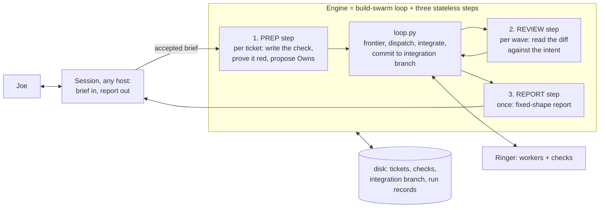

# Concept: the orchestration engine (loop in code, judgment as stateless calls)

Status: sketch, parked on purpose. Not an intent, nothing built. Written
2026-09-20 so that "let's talk about the engine build" starts from here.

Trigger to pick it up: an orchestrated run under pm 0.21 rules (fresh session,
context budget) where the lead seat still uses more tokens than its workers.
That is pm-021's open measure. If the lean session holds, this stays parked.

Read first: [pm-021](../intent/pm-021-orchestrated-runs.md) (the evidence and
the numbers) · [Marvel field report](orchestrate-ringer-field-report-marvel-2026-09-20.md) ·
[Hermes pilot 2](hermes-tokenusage-pilot-2-2026-09-15.md) · the `build-swarm`
skill in `_Core/library/skills/agent-operations/` · library pages
`token-economics`, `loop-engineering`, `open-engine`, `software-factory`.

## The idea in one line

The session is Joe's front desk. The loop that works the tickets is code. A
model is called only for a judgment, fresh each time, with a small packet.

**Quality is the gate, ahead of tokens.** Joe, 2026-09-20: more work with less
intervention is the goal, but not at the cost of generating garbage. Any rung of
the proof that lowers check quality or first-try rate stops the idea, however
cheap it got.

## Why

Every model call re-reads its whole conversation. An orchestrator that lives in
one conversation pays for that conversation on every step: 125 calls at ~436K
in Marvel (54.6M tokens against 20.15M for all eight workers), 311 calls at
~236K in Hermes. Hermes can cap its context; a Claude Code or Codex session
mostly can't. Code has no context. State on disk costs nothing to keep.

## Fleet check, 2026-09-20 (three weeks of Claude Code session logs)

| Week | Tokens | Calls | Context per call | Session files |
|---|---:|---:|---:|---:|
| 09-01 to 09-06 | 1,236M | 5,185 | 238K | 122 |
| 09-07 to 09-13 | 989M | 5,180 | 190K | 152 |
| 09-14 to 09-20 (orchestration started) | 2,545M | 10,854 | 234K | 189 |

Usage went 2.6x the week orchestration started, and Joe felt it in his limits.
Context per call did not move. **Calls doubled.** An orchestrator plus parallel
lanes plus workers is simply more model calls at once. Over 09-14 to 09-16 the
SB-SOS orchestrator and its lane worktrees were about 957M of 1,924M. The Marvel
lead seat's 436K per call was its own problem (a day-old session); the fleet
problem is volume.

What this cannot say: whether 2.6x the tokens bought 2.6x the accepted work.
Tokens per accepted ticket is the number that decides all of this, and nothing
records it yet. An engine lowers context per call, which is not what grew, so
this data weakens the case for it. Cheaper levers first: fewer parallel lanes,
and a leaner session baseline (this session carried about 32K of MCP tool and
skill definitions on every call; at 10,854 calls a week that is about 350M).

Method: `~/.claude/projects/**/*.jsonl`, assistant `message.usage`, de-duplicated
by message id per file, all four token categories. Codex and Hermes not included.

## Most of it already exists

`build-swarm`'s `scripts/loop.py` is this loop, in code, over Ringer, hardened
through twelve two-seat gate rounds:

| Engine need | Already there |
|---|---|
| Frontier from a ticket DAG | `seam.py` over local markdown tickets (`Blocked by`, `Status`, `Check`, `Owns`) |
| Dispatch, verify, retry | Ringer (`ringer run`), any CLI lane, executed checks |
| Red proved before dispatch | loop preflight, environmental red rejected |
| Worktree made runnable | `--setup <committed script>`, `BUILD_SWARM_RUNTIME` |
| Integrate, one commit per ticket, full suite centrally | loop integration transaction, back-out and reopen on red |
| Park instead of grind; discovered work quarantined | `needs-human`, `## Discovered` |
| Pause, status, diagnosed recovery | `control.py`, `recovery.py` |
| Budgets and scoped autonomy | `--max-tasks`, Execution agreement (`dc-autonomy-v1`) |
| Host-agnostic | `--engine` / `--model`; nothing in it knows which session started it |

So this is not a new tool. It is three additions around a loop Joe already owns.

## The gap: three judgment steps still live in the session

| Step | Today | In the engine | Packet in | Out |
|---|---|---|---|---|
| Prep | The session scouts, writes acceptance tests and Owns (16 min and most of the context in Marvel) | One Ringer task per ticket, run as a wave before the build wave | ticket, intent constraints, the few interface files named by a cheap scout | committed `checks/<slug>`, `Owns`, red proof |
| Review | The session reads each patch, or nobody does until the gate | One bounded review task per wave, conditional like pm's review schedule | intent, integrated diff, check evidence, one question | findings; the loop parks or continues |
| Report | The session writes it from a full context | One call over the run records | run records, ticket states, commits | shipped / proved / not verified / waiting on Joe, plus seat usage |

Everything else stays deterministic. No step keeps a conversation.

## Design rules it must keep

- State is the tickets directory, the integration branch and Ringer's run
  records. Nothing a model wrote decides what runs next except through a ticket.
- A prep task never owns the code it writes a check for, and a build task never
  owns `checks/` or `tests/` (the loop already enforces the second half).
- Human gates are ticket states. `needs-human` leaves the agent frontier.
- The contract stays brief → tickets with checks → reports, so a hosted
  coordinator (Claude Code's Projects beta: one coordinator, a cloud thread per
  task, the coordinator sees reports only) could later be one more lane. It is
  Claude-only, cloud-only and has no executed checks, so it does not replace this.

## Open questions for the build conversation

1. Does prep quality survive a small packet? The Marvel orchestrator's tests
   were the best thing in that run, written with the whole repo in its head. Test
   this first, by hand, on three real tickets, before writing anything.
2. Who scouts the interface files for a prep packet: a cheap model, or grep rules?
3. One prep task per ticket, or one for the whole brief so shared fixtures agree?
4. Where does it live: inside the `build-swarm` skill (likely), or Ringer?
5. `dc-loop` was parked by its ADR 0006 as too big for the problem. That repo is
   not on this Mac and the ADR was not read for this sketch. Read it before
   building, so the same weight isn't rebuilt.
6. How the session starts and watches a run without holding its output:
   start detached, read `control.py status` and the final report only.

## Smallest proof

No new code. Take three tickets from a real repo. Run prep as three plain
Ringer tasks with hand-built packets, commit their checks, run `loop.py
--wave 1` on an integration branch, then one review task and one report call.
Measure total tokens against the same three tickets done the Marvel way. If it
isn't at least three times cheaper with the same first-try rate, stop.
